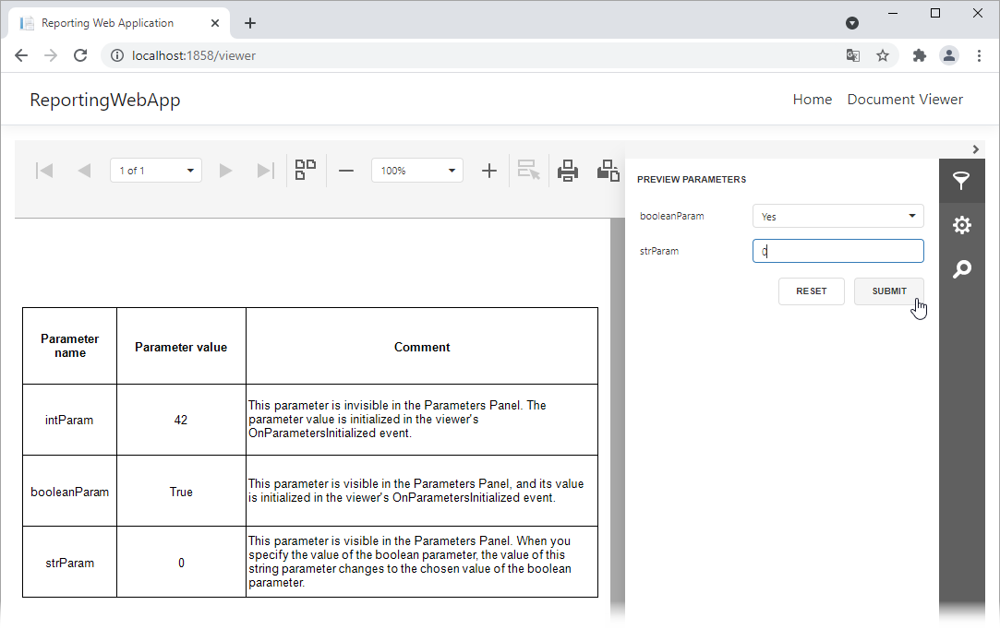

# Reporting for Angular - Handle the ParametersInitialized event

The example below demonstrates how to handle the [ParametersInitialized](https://docs.devexpress.com/XtraReports/DevExpress.XtraReports.Web.WebDocumentViewerClientSideEvents.ParametersInitialized) event to do the following:

1. Initialize values of a visible and invisible parameter before the viewer loads the document.
2. Change a parameter value in the panel's editor when a user assigns a value to another parameter.

<!-- default file list -->

## Files to Look At

- [report-viewer.html](CS/ReportingWebApp/ClientApp/src/app/reportviewer/report-viewer.html)
- [report-viewer.ts](CS/ReportingWebApp/ClientApp/src/app/reportviewer/report-viewer.ts)

<!-- default file list end -->

## How to Run the Example

Download the project and do the following:

1. Update NuGet packages.
2. Build and run the project.
3. Navigate to the page that contains the document viewer.

## Documentation

- [Specify Parameter Values in an Angular Reporting Application](https://docs.devexpress.com/XtraReports/401930)

## More Examples

- [Reporting for Angular - Use Custom UI Elements to Specify Parameter Values](https://github.com/DevExpress-Examples/angular-reporting-use-custom-ui-elements-to-specify-parameters)
