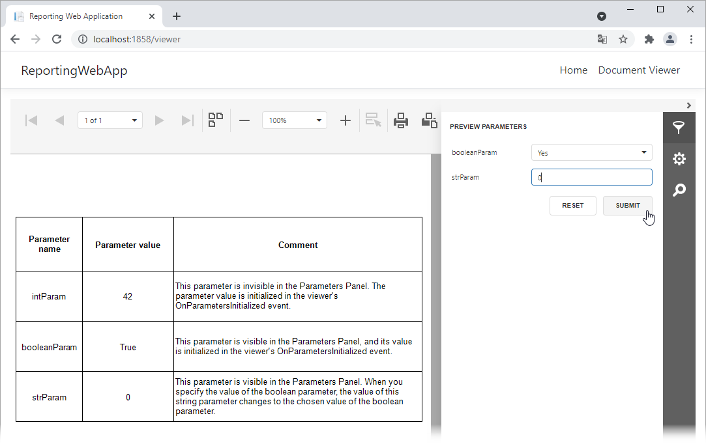

<!-- default badges list -->

[](https://supportcenter.devexpress.com/ticket/details/T1034344)
[](https://docs.devexpress.com/GeneralInformation/403183)
[](#does-this-example-address-your-development-requirementsobjectives)
<!-- default badges end -->
# Reporting for Angular - Handle the ParametersInitialized event

The example below demonstrates how to handle the [ParametersInitialized](https://docs.devexpress.com/XtraReports/DevExpress.XtraReports.Web.WebDocumentViewerClientSideEvents.ParametersInitialized) event to do the following:

1. Initialize values of a visible and invisible parameter before the viewer loads the document.
2. Change a parameter value in the panel's editor when a user assigns a value to another parameter.



## Run the Project

Navigate to the *ReportingWebApp/ReportingWebApp.Server* folder and use the following command to restore dependencies and run the application:

```console
cd ReportingWebApp/ReportingWebApp.Server
dotnet run
```

Two command prompts appear:

- The ASP.NET Core API project running
- The Angular CLI running the ng start command

Open your browser and navigate to the URL specified in the command output to see the result.


## Files to Review

- [report-viewer.html](ReportingWebApp/ClientApp/src/app/reportviewer/report-viewer.html)
- [report-viewer.ts](ReportingWebApp/ClientApp/src/app/reportviewer/report-viewer.ts)

## Documentation

- [Specify Parameter Values in an Angular Reporting Application](https://docs.devexpress.com/XtraReports/401930)

## More Examples

- [Reporting for Angular - Use Custom UI Elements to Specify Parameter Values](https://github.com/DevExpress-Examples/angular-reporting-use-custom-ui-elements-to-specify-parameters)
<!-- feedback -->
## Does This Example Address Your Development Requirements/Objectives?

[](https://www.devexpress.com/support/examples/survey.xml?utm_source=github&utm_campaign=angular-reporting-handle-parameters-initialized-event&~~~was_helpful=yes) [](https://www.devexpress.com/support/examples/survey.xml?utm_source=github&utm_campaign=angular-reporting-handle-parameters-initialized-event&~~~was_helpful=no)

(you will be redirected to DevExpress.com to submit your response)
<!-- feedback end -->
